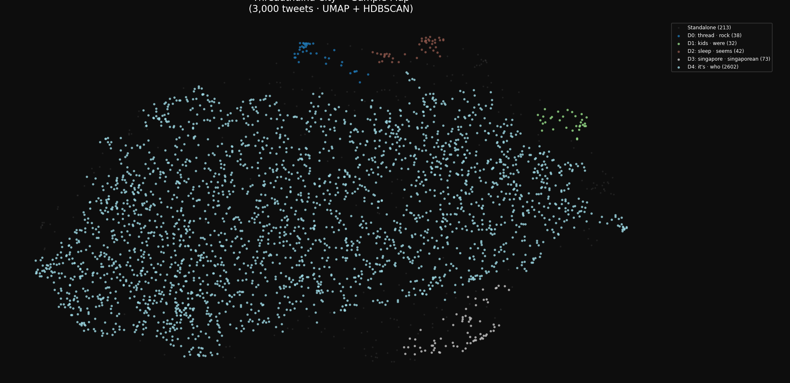
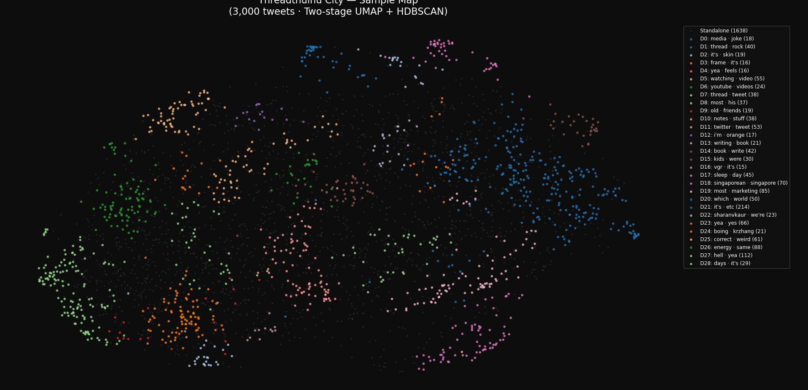

# Session 01 — Data Pipeline
*Date: March 19, 2026*
*Status: Complete. Full archive embedding in progress (script 04 running).*

---

## What We Did This Session

Inspected the archive, made all architecture decisions, wrote and ran the complete
data pipeline (scripts 01–04). Iterated on the clustering approach after the first
run produced a near-useless single-blob result. Second approach worked well.

---

## Archive Inspection Results

File: `visakanv_twitter_archive.json` (Community Archive format)

| Metric | Value |
|--------|-------|
| Total tweets in archive | 259,083 |
| After filtering retweets + non-English | ~247,011 |
| Date range | Jan 2019 – Sep 2024 |
| Top liked tweet | 183,042 likes |
| Tweets with 0 likes | 57,788 (future hidden alleys) |
| Available fields | id, full_text, created_at, favorite_count, retweet_count, in_reply_to_status_id, lang |

**Important note on date range:** The archive only goes back to January 2019, not
2008 (account creation). This is likely a Community Archive limitation — Visa's
account has 15+ years of tweets but only ~5.5 years are in this export. Worth
asking Visa if he has an older export. The 2019–2024 data is sufficient to build
a compelling city.

**Also in the archive:** `note-tweet` entries (Twitter's long-form notes). Not
yet included in the pipeline — could be added later as a special building type.

---

## Architecture Decisions Made

*(Full details in `docs/architecture.md`)*

| Decision | Choice |
|----------|--------|
| Embeddings | `all-mpnet-base-v2` — local, free, GPU-accelerated |
| 2D layout | Two-stage UMAP (15D for clustering, 2D for visualisation) |
| Clustering | HDBSCAN on 15D UMAP space |
| Frontend renderer | Pixi.js (WebGL) |
| Fog of war | Browser localStorage |
| Deployment | Vercel static site |

---

## Files Created This Session

```
threadthulhu/
├── pipeline/
│   ├── requirements.txt              — Python dependencies + CUDA install instructions
│   ├── 01_parse_archive.py           — Clean raw JSON → data/tweets_cleaned.json
│   ├── 02_embed_sample.py            — Embed 3k sample → data/sample_embeddings.npy
│   ├── 03_visualize_sample.py        — UMAP + HDBSCAN → scatter plot + neighbourhood summaries
│   └── 04_embed_full.py              — Embed all ~247k tweets → data/full_embeddings.npy
├── docs/
│   ├── architecture.md               — Full architecture reference
│   ├── session-01-data-pipeline.md   — This document
│   └── screenshots/
│       ├── sample-map-v1-blob.png    — First attempt: single giant blob (broken)
│       └── sample-map-v2-two-stage.png — Second attempt: 29 districts (working)
└── data/                             — Populated by running the scripts
```

---

## Running the Pipeline

### Prerequisites

```bash
# Install PyTorch with CUDA (NVIDIA GPU support)
pip install torch --index-url https://download.pytorch.org/whl/cu121

# Verify GPU works
python -c "import torch; print(torch.cuda.is_available())"
# Should print: True

# Install remaining dependencies
pip install -r pipeline/requirements.txt
```

### Scripts (run in order from threadthulhu/ folder)

```bash
py pipeline/01_parse_archive.py       # ~1 min  — parse + clean archive
py pipeline/02_embed_sample.py        # ~1 min  — embed 3k sample (downloads model on first run)
py pipeline/03_visualize_sample.py    # ~3 min  — UMAP + cluster + scatter plot
py pipeline/04_embed_full.py          # ~25 min — embed full archive on GPU
# 05_map_full.py                      — TODO next session
```

---

## Iteration Log: Getting the Clustering Right

### Attempt 1 — HDBSCAN directly on 2D UMAP (broken)

**Script version:** `03_visualize_sample.py` v1

**Parameters:**
- UMAP: 768D → 2D, n_neighbors=15, min_dist=0.1
- HDBSCAN: min_cluster_size=20 on the 2D output

**Result:** 5 clusters total. District 4 = 2,602 of 3,000 tweets (87% of the sample).

**Screenshot:** `docs/screenshots/sample-map-v1-blob.png`



**Why it failed:** Projecting 768 dimensions down to just 2 compresses so much
structure away that HDBSCAN sees one giant density mass. The algorithm isn't wrong —
in 2D, most of the tweets genuinely do form one blob. The problem is using 2D for
both clustering and visualisation.

---

### Attempt 2 — Two-stage UMAP (working)

**Script version:** `03_visualize_sample.py` v2

**The fix — separate clustering from visualisation:**

| Step | Purpose | Dimensions | Parameters |
|------|---------|------------|------------|
| UMAP (stage 1) | Clustering | 768D → 15D | n_neighbors=30, min_dist=0.0 |
| HDBSCAN | Find districts | 15D space | min_cluster_size=15 |
| UMAP (stage 2) | Visual layout | 768D → 2D | n_neighbors=15, min_dist=0.1 |

15D UMAP preserves far more semantic structure than 2D. HDBSCAN finds genuine
clusters there. The 2D UMAP is only used for drawing the map — not for clustering.
This is standard practice in single-cell biology (the field that uses UMAP+HDBSCAN
most heavily) and produced dramatically better results.

**Result:** 29 districts found, 1,638 standalone/noise points.

**Screenshot:** `docs/screenshots/sample-map-v2-two-stage.png`



**Recognisable districts from the sample:**

| District | Keywords | Notes |
|----------|----------|-------|
| D18 | singaporean · singapore | Singapore / identity district |
| D15 | kids · were | Parenting / family |
| D17 | sleep · day | Health / rest |
| D5 | watching · video | Media consumption |
| D6 | youtube · videos | Video content (adjacent to D5 — related) |
| D13 | writing · book | Writing craft |
| D14 | book · write | Reading / books (adjacent to D13) |
| D11 | twitter · tweet | Meta-Twitter |
| D7 | thread · tweet | Threading / meta (adjacent to D11) |
| D19 | most · marketing | Business / marketing |
| D27 | hell · yea | Enthusiasm / affirmations |

**Remaining issues:**
- D21 (it's · etc, 214 tweets) — still a catch-all blob. Will fragment further with full archive.
- Several district labels show contractions ("it's", "i'm") slipping through the
  stopword filter — stopword list uses regex `[a-zA-Z']{3,}` which catches "it's"
  as a word but "it's" isn't in the stopwords. Labels are cosmetic; clustering is fine.
- 1,638 standalones (55%) — expected given Visa's writing style. Will reduce as
  a proportion with 247k tweets providing more density.

**Conclusion:** The two-stage approach works. The sample validates the method.
Proceeding to full archive embed.

---

## What to Expect from the Full Archive Run

With 247k tweets vs. 3k sample:
- The catch-all districts will break into meaningful sub-districts
- More rare topics will have enough density to form their own districts
- Standalone count will drop as a proportion (more neighbours = fewer outliers)
- Expect 15–40 coherent districts in the final city

---

## Next Session (02)

**Goal:** Build the canvas prototype.

Steps:
1. Run `05_map_full.py` — UMAP + HDBSCAN on full 247k embeddings (to be written)
2. Review full city district map — what are the actual neighbourhoods?
3. Scaffold React + Vite + Pixi.js frontend
4. Render neighbourhood blobs from `full_mapped.json`
5. Basic zoom/pan working

**Key question:** What do the full archive districts actually look like?
How many are there? Do they match our intuitions about Visa's themes?
