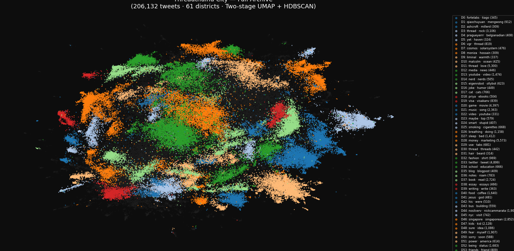

# Session 02 — Full Archive Map
*Date: March 20, 2026*
*Status: Complete. Full city map generated. Frontend next.*

---

## What We Did This Session

Ran the full archive through the pipeline, debugged two issues, and produced
the first complete map of Threadthulhu City — 206,132 tweets across 61 districts.

---

## Pipeline Run

### Script 04 — Embed Full Archive

Embedded all ~247k tweets using `all-mpnet-base-v2`.

**Issue hit:** `torch.OutOfMemoryError` — GPU only has 2GB VRAM.
**Fix:** Reduced `BATCH_SIZE` from 128 → 32. Added `PYTORCH_CUDA_ALLOC_CONF=expandable_segments:True`.
**Result:** Completed successfully in ~25 min.

### Script 05 — Map Full Archive

Two runs needed due to bugs and parameter tuning.

**Issue 1:** `TypeError: Object of type int64 is not JSON serializable`
**Fix:** Added a `NumpyEncoder(json.JSONEncoder)` class to handle all numpy types at once.
Applied to both `json.dump` calls in the script.

**Issue 2:** 200+ districts on first run (min_cluster_size=100 too low for 247k tweets).
**Fix:** Raised `HDBSCAN_MIN_CLUSTER_SIZE` from 100 → 300.
**Result:** 61 districts, 64.7% standalone/noise.

**Issue 3:** `https` appearing as a top keyword in almost every district.
Visa links to things constantly — URL tokens were polluting all labels.
**Fix:** Added `https`, `http`, `com`, `www` to stopwords in both scripts 03 and 05.

**Performance optimisation added:** Script 05 now caches the 15D UMAP output to
`data/_umap_15d.npy`. Re-runs (for HDBSCAN tuning, keyword fixes, etc.) skip the
slow UMAP step and go straight to clustering. Saved ~15 min per iteration.

---

## The Map

**206,132 tweets · 61 districts · 133,467 standalones (64.7%)**

Screenshot: `docs/screenshots/full-map-v1-clean.png`



### Recognisable Districts

| District | Keywords | Notes |
|----------|----------|-------|
| D46 | singapore | Singapore / identity |
| D47 | kids | Parenting / family |
| D27 | sleep | Health / rest |
| D21 | music | Music |
| D20 | game | Gaming |
| D37 | book | Books / reading |
| D39 | writing, write | Writing craft |
| D28 | money | Money / finance |
| D40 | food | Food |
| D54 | women, men | Gender / relationships |
| D53 | friends | Friendship |
| D49 | fear | Psychology / fear |
| D33 | twitter | Meta-Twitter |
| D6 | vgr | Venkatesh Rao has his own district |
| D4 | pragueyerrr | **Pragya (the builder) has her own district** — Visa tweets at/about her enough to form a cluster |
| D11 | thread | Threading / meta (5,300 tweets — one of the largest) |

### On the 64.7% Standalone Rate

More than half of Visa's tweets are unclustered. This is expected and honest — his writing
is conversational and radically interconnected. Many tweets are one-off observations, replies,
and riffs that genuinely don't belong to a single theme. In the city metaphor these are the
standalone buildings, the hidden alleys, the street-level life between the named districts.
They still have coordinates on the map and will be visible in the frontend — just not
labelled as part of a named neighbourhood.

---

## Key Observations

1. **The shape is a city.** Dense core, distinct peninsulas, outlier clusters — it looks
   genuinely geographic. The UMAP layout is doing exactly what it should.

2. **Adjacent districts are semantically related.** Writing (D39) and books (D37) sit near
   each other. Sleep (D27) and breathing (D26) are neighbours. The spatial structure is real.

3. **`https` was polluting every label.** Visa links heavily — URL tokens dominated word
   frequency in every cluster. Fixed by adding URL tokens to stopwords.

4. **Pragya is in the archive.** D4 is tweets at/about @pragueyerrr — she's a named
   district in her friend's mind-city. A genuine easter egg for when Visa sees it.

---

## Parameter State (final for this session)

| Parameter | Value | File |
|-----------|-------|------|
| HDBSCAN_MIN_CLUSTER_SIZE | 300 | 05_map_full.py |
| HDBSCAN_MIN_SAMPLES | 10 | 05_map_full.py |
| UMAP cluster n_neighbors | 30 | 05_map_full.py |
| UMAP viz n_neighbors | 15 | 05_map_full.py |
| GPU batch size | 32 | 04_embed_full.py |

---

## Files Generated (gitignored — not committed)

```
data/full_embeddings.npy      — 247k tweet vectors (~700MB)
data/full_tweets_meta.json    — tweet metadata
data/_umap_15d.npy            — cached 15D UMAP (skip on re-runs)
data/full_mapped.json         — all tweets with x/y + cluster ID
data/full_map.png             — scatter plot
data/district_summary.json    — per-district stats + keywords
```

---

## Two-Level Hierarchy Decision

After reviewing the 61-district map, decided to implement a **two-zoom-level city**:

- **Top level** (`cluster_top`) — 20-30 named districts, visible zoomed out. `min_cluster_size=750`
- **Sub level** (`cluster_sub`) — ~61 sub-districts, visible zoomed in. `min_cluster_size=300`

Each tweet gets both IDs. The frontend switches between them at a zoom threshold.
This mirrors real cities: borough → neighbourhood → street, and honours both the
"navigable city" goal and Visa's original "massive spreadsheet" instinct.

Script 05 updated to run two HDBSCAN passes on the same cached 15D UMAP.

---

## Next Session (03)

**Goal:** Build the React + Pixi.js frontend. Render the city.

Steps:
1. Scaffold React + Vite project in `frontend/`
2. Install Pixi.js + viewport plugin
3. Load `full_mapped.json` and render dots on a canvas
4. Colour by district
5. Add zoom/pan
6. Basic neighbourhood labels

**The question going into session 03:** What does the city feel like to move around in?
Does the layout feel geographic and explorable, or does it need visual treatment first?
